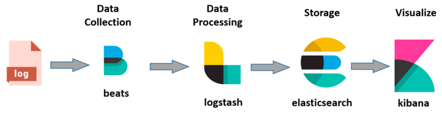
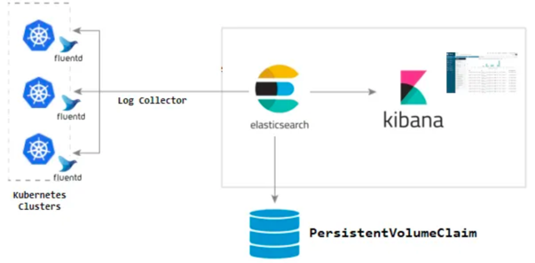

# grafana-loki

## 일반 적인 로그 수집 시스템

### 구성 서비스

1. ElasticSearch: 저장을 위한 모듈로 수집한 데이터가 라이프사이클에 의해 저장되는 공간
2. Logstash: 다수의 Source 에서 다양한 이벤트를 수집
3. Fluentd: 로그(데이터) 수집기(collector)
4. Kibana: 분석을 위한 모듈로 ElasticSearch 에 저장된 데이터를 Visualize 하는 대시보드
5. Beats: 단일 목적의 데이터 수집기 무료 오픈 소스 플랫폼, 여러 제품이 있다(Filebeat, Packetbeat...)

### ELK(Elasticsearch, LogStash, Kibana) + Beats

기존 ELK 스택 에서 추가로 Beats 등의 하나 이상의 구성요소가 필요하여 **Elastic Stack** 이라고 변경됨

- [aws, ELK 스택이란 무엇인가요?](https://aws.amazon.com/ko/what-is/elk-stack/)

1. beat 가 로그를 수집
2. beats 가 수집한 로그를 logstash 에서 적절 하게 처리한 후 Elasticsearch 로 전달
3. elasticsearch 는 인덱싱하여 저장
4. elasticsearch 와 연결된 kibana UI 에서 해당 로그 확인

### EFK(Elasticsearch, Fluentd, Kibana)

Elastic Stack 에서 LogStash 가 제외 되었고 Beats 가 Fluentd 로 변경됨  
중간에 Kafka 를 추가하기도함

- [EKS 환경에서의 EFK 도입기, 여기어때 기술블로그](https://techblog.gccompany.co.kr/eks-%ED%99%98%EA%B2%BD%EC%97%90%EC%84%9C%EC%9D%98-efk-%EB%8F%84%EC%9E%85%EA%B8%B0-e8a92695e991)

1. 각 쿠버네티스 환경에 배포된 시스템에서 로그를 fluentd 가 수집
2. fluentd 가 이 로그를 elasticsearch 에 보내주면 elasticsearch 는 인덱싱하여 저장
3. elasticsearch 와 연결된 kibana UI 에서 해당 로그 확인

## Grafana Loki 란?

Loki 는 Prometheus 에서 영감을 받은 수평 확장성, 고가용성, 멀티 테넌트 로그 수집(집계) 시스템이다.  
비용적으로 매우 효율적이고 작동하기 쉬운 방식으로 설계되었다.

로그의 내용을 인덱싱하지 않고 각 로그 스트림에 대한 레이블 세트를 인덱싱한다.  
Loki 프로젝트는 2018년 Grafana Labs에서 시작되어 KubeCon Seattle 에서 발표되었다.

Loki 는 **AGPLv3** 라이선스에 따라 출시됨.

### 참조

- https://grafana.com/oss/loki/
- https://devocean.sk.com/blog/techBoardDetail.do?ID=163964
