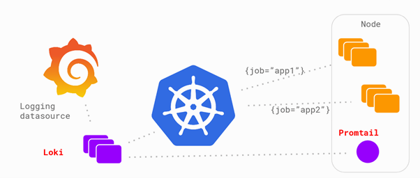
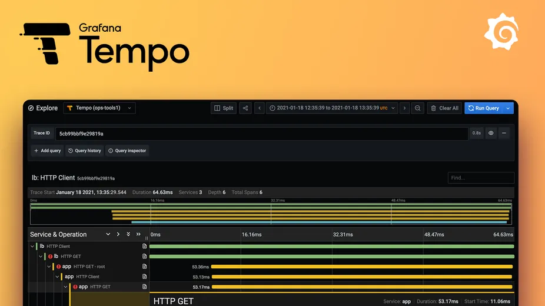
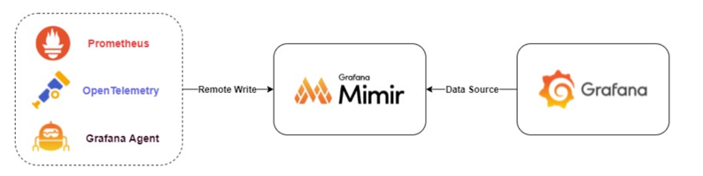
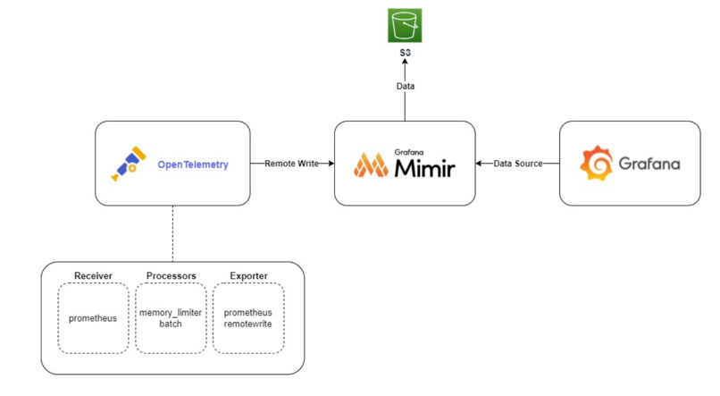
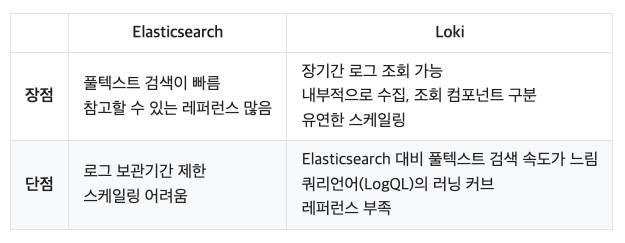

# grafana-loki

## 로그 수집 장점

1. 사용자 행동 분석 로그 데이터를 통해 사용자의 행동 패턴을 파악하고 이를 바탕으로 서비스 개선 및 마케팅 전략을 세울 수 있다.
2. 오류 및 버그 추적 로그를 통해 시스템 내 발생한 오류나 문제를 확인하고 추적할 수 있어, 소프트웨어의 안정성과 품질을 개선할 수 있다.
3. 성능 최적화 로그 데이터를 분석하여 데이터 베이스 작업, API 호출, 시스템 리소스 사용 등 시스템의 성능 상태를 파악하고, 이를 통해 성능 문제점을 찾아 수정할 수 있다.

> 로그 데이터를 통해 사용자의 행동 패턴을 파악하고 이를 바탕으로 서비스 개선을 할 수 이으며, 로그를 통해 시스템 내  
  발생한 오류나 문제를 확인하고 추적할 수 있어, 서비스의 안정성과 품질을 개선할 수 있다

## 일반 적인 로그 수집 시스템

### 구성 서비스

1. ElasticSearch: 저장을 위한 모듈로 수집한 데이터가 라이프사이클에 의해 저장되는 공간
2. Logstash: 다수의 Source 에서 다양한 이벤트를 수집, 서버 측 데이터 처리 파이프라인
3. Fluentd: 로그(데이터) 수집기(collector)
4. Kibana: 분석을 위한 모듈로 ElasticSearch 에 저장된 데이터를 Visualize 하는 대시보드
5. Beats: 단일 목적의 데이터 수집기 무료 오픈 소스 플랫폼, 여러 제품이 있다(Filebeat, Packetbeat...)

### ELK(Elasticsearch, LogStash, Kibana) + Beats

기존 ELK 스택 에서 추가로 Beats 등의 하나 이상의 구성요소가 필요하여 **Elastic Stack** 이라고 변경됨

- [aws, ELK 스택이란 무엇인가요?](https://aws.amazon.com/ko/what-is/elk-stack/)

1. beat 가 로그를 수집
2. beats 가 수집한 로그를 logstash 에서 적절 하게 처리한 후 Elasticsearch 로 전달
3. elasticsearch 는 인덱싱하여 저장
4. elasticsearch 와 연결된 kibana UI 에서 해당 로그 확인

### EFK(Elasticsearch, Fluentd, Kibana)

Elastic Stack 에서 LogStash 가 제외 되었고 Beats 가 Fluentd 로 변경됨  
중간에 Kafka 를 추가하기도함

- [EKS 환경에서의 EFK 도입기, 여기어때 기술블로그](https://techblog.gccompany.co.kr/eks-%ED%99%98%EA%B2%BD%EC%97%90%EC%84%9C%EC%9D%98-efk-%EB%8F%84%EC%9E%85%EA%B8%B0-e8a92695e991)

1. 각 쿠버네티스 환경에 배포된 시스템에서 로그를 fluentd 가 수집
2. fluentd 가 이 로그를 elasticsearch 에 보내주면 elasticsearch 는 인덱싱하여 저장
3. elasticsearch 와 연결된 kibana UI 에서 해당 로그 확인

## Grafana Loki 란?

**like Prometheus, but for logs.**

Loki 는 Prometheus 에서 영감을 받은 수평 확장성, 고가용성, 멀티 테넌트 로그 수집(집계) 시스템이다.  
비용적으로 매우 효율적이고 작동하기 쉬운 방식으로 설계되었다.

로그의 내용을 인덱싱하지 않고 각 로그 스트림에 대한 레이블 세트를 인덱싱한다.  
Loki 프로젝트는 2018년 Grafana Labs에서 시작되어 KubeCon Seattle 에서 발표되었다.

Loki 는 **AGPLv3** 라이선스에 따라 출시됨.

### Loki 장점

- Object Storage 지원
- 실시간 로그 추적(Live tail)
- Prometheus, Grafana 및 K8s와 기본적으로 통합되어 단일 UI 내에서 메트릭, 로그 및 추적 간에 원활하게 이동
- 멀티 테넌시 지원

### 구성 서비스

PLG Stack 이라고도함

1. Promtail: 로그를 수집하는 에이전트로 로그를 수집해 Loki로 로그를 전송하는 역할
2. Loki: 오픈소스 타입의 로그 모니터링 도구로, 로그를 Label을 통해 그룹화해 처리
3. Grafana: 멀티플랫폼 오픈 소스 애널리틱스 및 인터랙티브 시각화 웹 애플리케이션

### 참조

- https://grafana.com/oss/loki/
- https://github.com/grafana/loki
- https://devocean.sk.com/blog/techBoardDetail.do?ID=163964

## LGTM

- looks good to me 🤣 
- Grafana 의 생태계인 LGTM(Loki, Grafana, Tempo, Mimir) 를 뜻함
- k8s 친화적임
- [DevOps LGTM 스택 도입기](https://medium.com/finda-tech/lgtm-%EC%8A%A4%ED%83%9D-%EB%8F%84%EC%9E%85%EA%B8%B0-aeb1424b8299)

### Logki: 로그 수집
### Grafana: 대시보드 제공
### Tempo: 트레이스를 위함

Grafana Tempo는 로그 및 추적 데이터를 수집하고 시각화하기 위한 오픈 소스 플랫폼 중 하나이다.  
분산 시스템에서 발생하는 로그와 추적 데이터를 확장 가능하게 수집하고, 이를 Grafana에서 제공하는 시각화 도구를  
사용하여 분석할 수 있도록 지원한다.

- [MSA 관측을 위한 Grafana Tempo 도입기(with OpenTelemetry)](https://techblog.pet-friends.co.kr/msa-%EA%B4%80%EC%B8%A1%EC%9D%84-%EC%9C%84%ED%95%9C-grafana-tempo-%EB%8F%84%EC%9E%85%EA%B8%B0-with-opentelemetry-c9f9d045e089)

#### Tempo 장점

1. 다양한 오브젝트 스토리지 저장이 가능하여 확장성과 비용을 효율적으로 관리
2. Tempo는 Grafana와 긴밀하게 통합되어 있어, 추적 데이터를 쉽게 시각화하고 분석할 수 있다.

### Mimir: 메트릭을 위함

Grafana Mimir는 2022년 Grafana Labs에서 개발한 오픈 소스 소프트웨어 프로젝트로 고성능, 장기, 분산형 메트릭 저장 시스템이다.   
Mimir는 Cortex의 기능과 GEM(Grafana Enterprise Metrics) 및 Grafana Cloud를 대규모로 실행하기 위해 개발한 기능을  
모두 AGPLv3 라이선스에 따라 결합했다고 한다.

#### 프로메테우스의 단점

1. 확장 및 고가용성 문제
   - 프로메테우스는 단일 서버로 동작하게 구현되어 있다. 즉, 서버가 내려가면 그 시간 동안 메트릭을 수집할 수 없게 됨
2. 오래된 데이터 보관 문제
   - 프로메테우스는 메트릭을 로컬 디스크에 수집하여 보관하는데, 저장소의 용량이 한계에 도달하면 오래된 데이터가 자동으로  
     삭제되어 일정 시간이 지난 데이터는 조회할 수 없게 된다.

#### Mimir 장점

- 100% Prometheus 와 호환되어 기존 Prometheus 사용자가 쉽게 전환할 수 있다.
- 분산 시스템으로 설계되어 고가용성을 지원하며, 수평 확장이 가능하다.
- S3, GCS, Azure Blob와 같은 오브젝트 스토리지에 장기 데이터를 보관할 수 있다.
- 샤딩 된 쿼리 엔진을 통해 쿼리를 병렬화하므로 빠른 쿼리가 가능하다.

## ELK vs Loki

- https://techblog.woowahan.com/14505/

### ELK

장점:
1. 강력한 검색 기능: Elasticsearch는 복잡한 쿼리와 빠른 검색 속도를 자랑하는 전문 검색 엔진.
2. 풍부한 데이터 처리: Logstash는 다양한 형식의 데이터를 처리하고 변환하는 강력한 도구.
3. 시각화와 대시보드: Kibana는 직관적이고 상세한 데이터 시각화 및 대시보드를 제공.
4. 확장성: 대용량 데이터 처리에 적합하며, 쉽게 확장할 수 있다.

단점:
1. 설정의 복잡성: 여러 구성 요소 간의 통합 및 설정이 다소 복잡할 수 있습니다.
2. 자원 요구량: 특히 Elasticsearch는 상당한 메모리와 CPU 자원을 필요로함.
3. 유지 관리: 대규모 시스템에서의 유지 관리가 도전적일 수 있음.

### Loki

장점:
1. 간소화된 아키텍처: Loki는 설정이 간단하고 운영하기 쉬운 경량 로그 처리 솔루션.
2. 경량화 및 효율성: 저장 공간과 CPU 사용량이 적다.
3. 통합된 시각화: Grafana와의 통합으로 강력한 시각화 기능을 제공.
4. 코스트 효율: 저장 공간 효율성이 비용 절감에 기여.

단점:
1. 검색 기능의 제한: Elasticsearch 만큼의 복잡한 쿼리 기능이나 속도를 제공하지 않음.
2. 저장 기능: 장기적인 로그 데이터 관리에 있어 다소 제한적일 수 있음.
3. 새로운 기술: 아직 발전 중인 기술로, 커뮤니티 지원이나 자료가 ELK 스택에 비해 제한적.

### Elasticsearch, Loki 장단점

