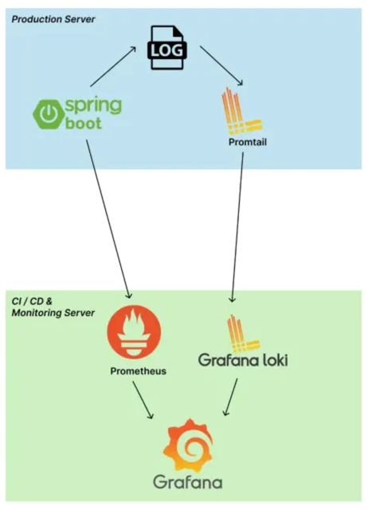
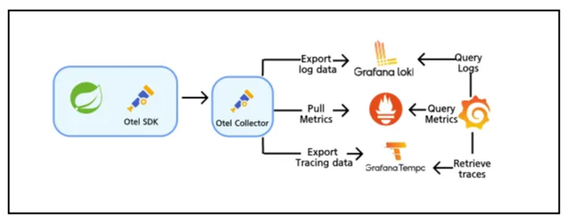

# grafana-loki

## docker-compose 를 통한 설치

- https://grafana.com/docs/loki/latest/setup/install/docker/#install-with-docker-compose

```shell
$ mkdir loki
$ cd loki
$ wget https://raw.githubusercontent.com/grafana/loki/v3.0.0/production/docker-compose.yaml -O docker-compose.yml
$ docker-compose up -d
```

## Spring Boot 로그를 loki 로 전송하는 방법

### 1. Promtail

### 2. loki-logback-appender

- https://github.com/loki4j/loki-logback-appender
- https://loki4j.github.io/loki-logback-appender/#quick-start
- [Logging in Spring Boot With Loki](https://www.baeldung.com/spring-boot-loki-grafana-logging)

### 3. Docker driver client

- https://grafana.com/docs/loki/latest/send-data/docker-driver/#docker-driver-client

## otel 도입 전/후

### otel 도입 전



### otel 도입 후



## blog post

- https://tech.scatterlab.co.kr/spring-boot-monitoring-with-prometheus/
- [Kubernetes 도입 후의 Observability 개선기](https://medium.com/@minina1868/kubernetes%EB%A5%BC-%EC%9D%B4%EC%9A%A9%ED%95%9C-observability-%EA%B0%9C%EC%84%A0%EA%B8%B0-with-spring-tempo-promtail-prometheus-loki-grafana-65f9a609c0bc)
- [OpenTelemetry, Grafana, Loki, Tempo, Prometheus를 활용한 Spring Boot Observability 구성하기](https://medium.com/@dudwls96/opentelemetry-grafana-loki-tempo-prometheus%EB%A5%BC-%ED%99%9C%EC%9A%A9%ED%95%9C-spring-boot-observability-%EA%B5%AC%EC%84%B1%ED%95%98%EA%B8%B0-f977df45bb70)
- [K8S/EKS에서 Opentelemetry Operator 사용 방법](https://medium.com/@junong29/k8s-eks%EC%97%90%EC%84%9C-opentelemetry-operator-%EC%82%AC%EC%9A%A9-%EB%B0%A9%EB%B2%95-5786891147d0)
- [OpenTelemetry 설치 준비: Operator 설치](https://www.anyflow.net/sw-engineer/install-opentelemetry-operator)
- [Kubernetes 환경에서 OpenTelemetry Collector 구성하기](https://medium.com/@dudwls96/kubernetes-%ED%99%98%EA%B2%BD%EC%97%90%EC%84%9C-opentelemetry-collector-%EA%B5%AC%EC%84%B1%ED%95%98%EA%B8%B0-d20e474a8b18)
