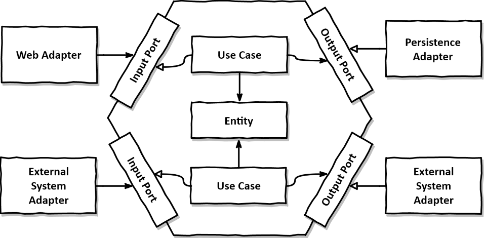

# hexagonal

## 헥사고날 아키텍처란? 

- 포트와 어댑터 아키텍처(Ports and Adapters Architecture)는 소프트웨어 아키텍처 중 하나로  
  Alistair Cockburn에 의해 제안됨.
- 이 아키텍처의 주요 목표는 응용 프로그램의 비즈니스 로직을 외부 세계로부터 격리시켜 유연하고 테스트하기   
  쉬운 구조를 만드는 것.
- 이를 위해 핵심 비즈니스 로직은 중앙의 도메인 영역에 위치하며, 입력과 출력을 처리하는 포트와 어댑터를  
  통해 외부와 소통한다.
- 어댑터의 경우 어플리케이션을 주도하는 드라이빙 어댑터, 어플리케이션에 의해 호출되는 드리븐 어댑터가 있다.

## 추가 정리

- 헥사고날의 경우 웹에 적용한 아키텍처로 만든것은 아니고 외부와의 격리를 통해 독립적으로 비지니스   
  로직 단위 테스트를 가능하게 만드는것이 목적이다.
- 톰 홈버그가 `만들면서 배우는 클린 아키텍처` 에서 웹에 적용한 모델을 제안하였음  
  로버트 마틴의 `클린 아키텍처` 의 `Use Case` 라는 개념을 가져와 Input Port 인터페이스에 사용 하였음.
- DDD 의 Layer Architecture(ui/application/domain/infra) 구조만으로도 충분히 헥사고날이 해결하려는  
  문제에 대해서 처리할 수 있다고 생각함
- 다만, 헥사고날에선 어플리케이션 코어(도메인 계층 + 어플리케이션 계층) 에 순수한 pojo 를 두고 jpa entity 는    
  드라이빙 어댑터에 둘지 두개를 합쳐서 둘지는 고민해봐야 하지만 순수하게 적용하기 위해선 분리해야한다.

## 참조

- [Hexagonal architecture](https://alistair.cockburn.us/hexagonal-architecture/)
- [Hexagonal architecture 2023 pdf](https://alistaircockburn.com/Hexagonal%20Budapest%2023-05-18.pdf)
- [github, thombergs/buckpal](https://github.com/thombergs/buckpal)
