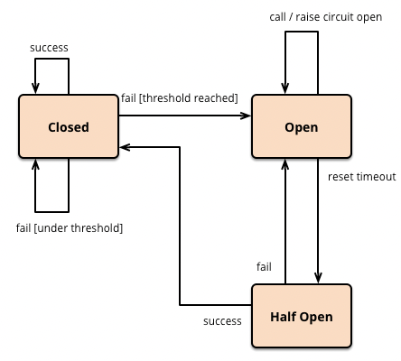

# resilience4j

## resilience4j 란 ?

- Resilience4j 는 함수형 프로그래밍을 위해 설계된 경량 **fault tolerance** 라이브러리이다.
- Netflix 의 Hystrix 가 유지보수로 전환된 이후 대체제로 많이 사용된다.

## Core Modules

### 1. CircuitBreaker

오류가 지속되면 회로를 열어 이후의 요청을 차단  
과부하를 방지하고 빠르게 장애를 감지

다음 3가지 상태를 가진다

- Closed
  - 정상 상태
- Open
  - 장애가 감지되어 모든 요청을 차단
- Half-Open
  - 일부 요청만 허용하여 상태 확인



**슬라이딩 윈도우** 를 사용하여 호출 결과를 저장하고 집계한다

> 슬라이딩 윈도우: 데이터 스트림에서 최근 일정 기간(또는 개수)의 데이터를 유지하며 계산하는 방식

- Count-based sliding window(default)
  - 마지막 N개 호출의 결과를 집계
- Time-based sliding window
  - 마지막 N초 호출의 결과를 집계

#### Fallback methods

동일한 클래스에 배치되어야 하며 예외 클래스를 제외하고 동일한 메서드 시그니처를 가져야 한다.

```kotlin

@Service
class SampleService {
  @CircuitBreaker(name = "google", fallbackMethod = "fallbackMethod")
  fun getData(id: String): String {
    // 예외 발생 
    return ""
  }

  fun fallbackMethod(id: String, ex: IllegalArgumentException): String {
    return "Fallback response for id: $id due to ${ex.message}"
  }
  
  fun fallbackMethod(id: String, ex: Throwable): String { 
    return "Fallback response for id: $id due to ${ex.message}"
  }
}
```

#### CircuitBreaker 가 필요한 이유?

circuit 이 open 되었을때 fallback 을 호출하는것은 비지니스적으로 완벽한 동작이 아닌데 필요한 이유는?

1. 장애가 확산되는 걸 방지
2. fallback 을 통해 최소한의 기능이라도 제공
3. half-open 상태에서 요청을 보내 확인하므로 자동 복구 기능 제공

> 서비스가 동작하지 않는 최악의 상황에서 최선의 결과를 제공할 수 있도록 지원

### 2. Bulkhead

동시 실행 횟수를 제한 하여 특정 서비스가 과부하 되지 않도록 방지

- SemaphoreBulkhead
  - 세마포어를 사용
- FixedThreadPoolBulkhead
  - 유한 큐와 고정 스레드 풀을 사용

### 3. RateLimiter

단위 시간동안 얼마만큼의 실행을 허용할 것인지 제한  
중요한 요청의 경우 실패시 Retry, BackOff 등의 전략을 함께 사용하는것이 권장

### 4. Retry

네트워크 장애 또는 일시적인 오류 발생 시 설정한 횟수 만큼 자동 재시도

### 5. TimeLimiter

지정된 시간 내에 완료되지 않으면 실패 처리하는 방식으로, 과도한 대기 시간을 방지

## Aspect order

각 모듈은 다음과 같은 우선 순위로 적용

`Retry ( CircuitBreaker ( RateLimiter ( TimeLimiter ( BulkHead ( TargetFunction ) ) ) ) )`

## Global failure count for multiple servers

다중 서버일 경우 각 서버별로 처리되므로 전역 설정을 위한 옵션을 지원하는지?

- 지원하지 않으며 추가 계획 없음 (2022-07-18)
- https://github.com/resilience4j/resilience4j/issues/1721

대안은?

1. Redis 기반 Rate Limiting (Bucket4j)
2. Api Gateway 에 CircuitBreaker 적용
    - [Spring Cloud Gateway, CircuitBreaker](https://docs.spring.io/spring-cloud-gateway/reference/spring-cloud-gateway/gatewayfilter-factories/circuitbreaker-filter-factory.html)
3. API Gateway 에 Rate Limiting 적용
    - [Spring Cloud Gateway, Redis RateLimiter](https://docs.spring.io/spring-cloud-gateway/reference/spring-cloud-gateway/gatewayfilter-factories/requestratelimiter-factory.html#redis-ratelimiter)
4. Redis 기반 분산 Bulkhead
    - redisson, RSemaphore, RPermitExpirableSemaphore
    - https://redisson.org/glossary/java-semaphore.html
5. HAProxy circuit breaker
    - https://www.haproxy.com/documentation/haproxy-configuration-tutorials/service-reliability/circuit-breakers

## 사용 예제

### Redis, DB 캐싱 구조

Redis 조회후 Miss 일 경우 RDB 를 조회하는 구조일때 Redis 서버와 통신이 불가능하다면  
redis 연결 대기시간만큼 latency 가 증가함

따라서 Redis 와 통신이 불가능할 경우 Circuit 을 Open 하여 바로 RDB 에서 조회하도록 처리 가능

- https://oliveyoung.tech/2023-08-31/circuitbreaker-inventory-squad/

## Code

### Dependency

- Spring Cloud 를 통해 사용 하는 방법과 직접 사용하는 방법이 있다.

```kotlin
// 1. Spring Cloud, Circuit breaker 구현에 대한 추상화 제공
dependencyManagement {
  imports {
    mavenBom("org.springframework.cloud:spring-cloud-dependencies:2024.0.0")
  }
}

implementation("org.springframework.cloud:spring-cloud-starter-circuitbreaker-resilience4j")

// 2. resilience4j 직접 사용
implementation("io.github.resilience4j:resilience4j-spring-boot3")
```

#### Actuator Health endpoint

```yaml
management:
  health:
    circuitbreakers:
      enabled: true # HealthIndicator Bean 등록 여부
    ratelimiters:
      enabled: true
  endpoints:
    web:
      exposure:
        include: "*"
  endpoint:
    health:
      show-details: always # 상세 내용 출력

resilience4j:
  circuitbreaker:
    configs:
      default:
        register-health-indicator: true # HealthIndicator 동작 여부, false 일 경우 UNKNOWN 으로 출력
    instances:
      google: # google 이라는 인스턴스 임시 등록
        base-config: default # default 의 경우 추가 하지 않아도 동작함, 프로퍼티 매핑을 위해 임시 추가
  ratelimiter:
    configs:
      default:
        register-health-indicator: true
    instances:
      google:
        base-config: default
```

```json
// http://localhost:8080/actuator/health
{
  "status": "UP",
  "components": {
    "circuitBreakers": {
      "status": "UP",
      "details": {
        "google": {
          "status": "UP",
          "details": {
            "failureRate": "-1.0%",
            "failureRateThreshold": "50.0%",
            "slowCallRate": "-1.0%",
            "slowCallRateThreshold": "100.0%",
            "bufferedCalls": 0,
            "slowCalls": 0,
            "slowFailedCalls": 0,
            "failedCalls": 0,
            "notPermittedCalls": 0,
            "state": "CLOSED"
          }
        }
      }
    }
  },
  "rateLimiters": {
    "status": "UP",
    "details": {
      "google": {
        "status": "UP",
        "details": {
          "availablePermissions": 50,
          "numberOfWaitingThreads": 0
        }
      }
    }
  }
}
```

## Troubleshooting

### CircuitBreaker interface fallback

- kotlin 의 경우 기본적으로 interface 의 body 가 있는 경우 java 의 default 메서드로 만들지 않으므로 하단옵션 추가해야함 

#### kotlin 1.x

```kotlin
kotlin {
  compilerOptions {
    freeCompilerArgs.addAll("-Xjsr305=strict", "-Xjvm-default=all")
  }
}
```

#### kotlin 2.x

```kotlin
kotlin {
    compilerOptions {
        jvmDefault = JvmDefaultMode.NO_COMPATIBILITY
    }
}
```

## 참조

- https://resilience4j.readme.io/docs/getting-started
- https://docs.spring.io/spring-cloud-circuitbreaker/reference/index.html
