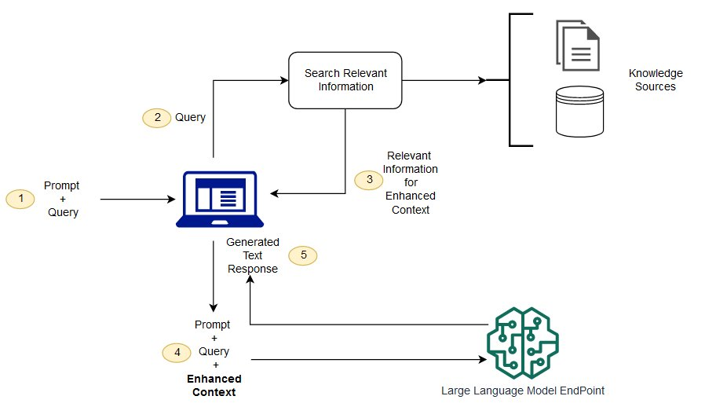

# Spring AI

## 소개

- https://docs.spring.io/spring-ai/reference/index.html
- 목표는 불필요한 복잡성 없이 인공지능 기능을 통합한 애플리케이션 개발을 간소화하는 것
- LangChain과 LlamaIndex와 같은 유명한 Python 프로젝트에서 영감을 얻었지만 포팅한것은 아님
- 차세대 생성 AI 애플리케이션이 Python 개발자만을 위한 것이 아니라 다양한 프로그래밍 언어에서  
  널리 사용될 것이라는 믿음을 바탕으로 시작

> Connecting your enterprise Data and APIs with AI Models

## RAG (Retrieval Augmented Generation)

- 대규모 언어 모델(LLM)이 가진 한계를 극복하는 데 유용한 기법으로, 긴 형식의 콘텐츠 처리, 사실 정확성  
  그리고 문맥 인식과 같은 문제를 보완한다.
- 대규모 언어 모델의 출력을 최적화하여 응답을 생성하기 전에 외부의 신뢰할 수 있는 기술 자료를 참조하도록 하는 프로세스.
- Embedding Model 을 활용하여 저장된 VectorStore 에서 유사도 검색을 통한 자료를 프롬프트에 보강한다.
- Hallucination(환각) 을 줄이는 방법이다.
  - **Hallucination**: 인공지능 영역에서는 AI가 잘못된 정보를 생성하는 현상 또는 기술적 오류를 의미한다.

### RAG 가 중요한 이유, LLM 의 알려진 문제점

- 답이 없을 때 허위 정보를 제공. (Hallucination) 
- 사용자가 구체적이고 최신의 응답을 기대할 때 오래되었거나 일반적인 정보를 제공.
- 신뢰할 수 없는 출처로부터 응답을 생성.
- 다양한 훈련 소스에서 동일한 용어를 사용하여 다른 내용을 설명하면서 용어 혼동으로 인해 응답이 부정확.

### RAG 의 이점

- 비용 효율적인 구현
  - 모델을 재교육하는것에 비해 비용이 효율적
- 최신 정보 제공
  - 모델에게 최신 연구, 통계등의 정보를 제공 할 수 있음
- 사용자 신뢰 강화
  - 모델이 데이터의 출처 또는 저작를 표시하게 하여 신뢰도 확보 가능
- 개발자 제어 강화
  - 변화하는 요구사항에 맞춰 정보를 제어할수 있다.

### RAG 동작

- 외부 데이터 생성
  - 임베딩 모델을 통한 벡터정보를 벡터스토어에 저장
- 관련 정보 검색
  - 사용자의 입력정보를 벡터로 변환하고 벡터스토어에서 유사도 검색을 통해 가져옴
- LLM 프롬프트 확장
  -  프롬프트 엔지니어링을 통하여 검색된 데이터를 프롬프트에 추가(보강)한다.
- 외부 데이터 업데이트 (ETL pipeline)
  - 최신 정보 검색을 유지하기 위해 문서를 주기적으로 업데이트하고 벡터스토어에 저장 

- 출처
  - https://aws.amazon.com/ko/what-is/retrieval-augmented-generation/

## ETL pipeline

- 추출(Extract), 변환(Transform), 적재(Load) 로 이루어진 ETL 프레임워크는 RAG(Retrieval Augmented Generation)  
  활용 사례에서 데이터 처리의 근간을 이룬다.
- ETL 파이프라인은 원시 데이터 소스로부터 구조화된 벡터 저장소(Vector Store)로의 흐름을 처리하여, AI 모델이 검색할 수 있도록  
  데이터가 최적의 형식으로 준비되도록 한다.
- RAG 활용 사례는 대규모 언어 모델의 생성 능력을 보강하기 위해, 데이터 집합에서 관련 정보를 검색하여 생성된 출력의 품질과  
  적합성을 향상시키는 것을 목표로 한다.

### DocumentReaders (Extract)

- JSON, Text, Markdown, PDF, DOCX, PPT 등 다양한 형식의 문서를 읽고 파싱한다.
- 원시 데이터를 Spring AI 파이프라인에서 처리할 수 있는 표준 문서(Document) 구조로 변환한다.

### Transformers (Transform)

- 문서 원본을 분리(Chunking) 하고, 필요시 전처리 및 변환(Preprocessing & Transformation) 을 수행한다.
- 예: 긴 문서를 작은 단위로 나누기, 불필요한 텍스트 제거, Embedding 변환 준비, metadata 추가하기

### Writers (Load)

- 전처리된 데이터를 VectorStore, 파일 등에 저장한다.
- 예: 벡터 임베딩을 Milvus, Pinecone, Elasticsearch, Redis 등에 기록.

## Chat Memory (Multi-turn)

- Multi-turn 이라고 주로 불린다.
- 대규모 언어 모델(LLM)은 상태 비저장(stateless) 방식으로, 이전 상호작용에 대한 정보를 유지하지 않는다.
- 이를 해결하기 위해 LLM과의 여러 상호작용에서 정보를 저장하고 검색할 수 있는 채팅 메모리 기능을 제공

### 해당 기능은 채팅 메모리를 관리하도록 설계됨

- Chat Memory: 대규모 언어 모델이 대화 전반에 걸쳐 **맥락적** 인식을 유지하기 위해 보관하고 사용하는 정보
- Chat History: 사용자와 모델 간에 교환된 모든 메시지를 포함한 전체 대화 기록입니다.

## Code & Examples

- https://github.com/spring-ai-community/awesome-spring-ai?tab=readme-ov-file#code--examples
- https://github.com/ThomasVitale/llm-apps-java-spring-ai/blob/main/observability/models/observability-models-openai/README.md
