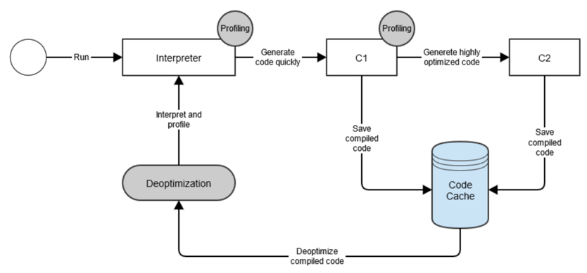

# warmup

## warmup 이란?

- 서버나 애플리케이션이 시작된 직후 일정 시간 동안, 혹은 요청 처리 전 미리 필요한 리소스나 컴포넌트를 준비해두는 과정
- 즉, 애플리케이션이 `준비 완료` 상태로서 안정적으로 요청을 처리하기 전에, 미리 예열해두는 단계

## jvm warmup 이 필요한 이유

### Cold Start

- 서버 실행 직후, 배포 직후 속도가 느려지는 현상, 초기 응답 지연 발생
- 서버나 애플리케이션이 막 기동된 직후, 아직 필요한 리소스들이 초기화되지 않아 첫 요청의 응답이 느려지는 현상

## 원인

### 클래스 로더

- 일반적으로 Lazy Loading 방식으로 동작  
- 배포 직후에는 대부분의 클래스들이 한번도 사용되지 않았으므로 클래스 로더에 의해 메모리에 적재되지 않은 상태

#### 종류

- Bootstrap Class Loader
  - JAVA_HOME\lib에 있는 코어 자바 API를 제공한다.
  - 최상위 우선순위를 가진 클래스 로더
- Extension Class Loader (Platform Class Loader)
  - JAVA_HOME\lib\ext 폴더 또는 java.ext.dirs 시스템 변수에 해당하는 위치에 있는 클래스를 읽는다.
- Application Class Loader (System Class Loader)
  - 개발자가 직접 작성하여 classpath에 있는 클래스를 로딩
  - 이 초기화 프로세스는 지연 로딩 방식 기반

#### spring boot jar 실행시엔?

- LaunchedClassLoader 라는 custom class loader 가 lib 하위의 jar 를 로드함

#### 외장톰캣 실행 시엔?

- https://tomcat.apache.org/tomcat-10.1-doc/class-loader-howto.html
- Bootstrap
  - Bootstrap + Extension 을 함께 표현함
- System
  - bootstrap.jar (Tomcat 시작용)
  - tomcat-juli.jar (로깅 구현체)
  - commons-daemon.jar (데몬 프로세스 지원)
- Common
  - Tomcat 내부 클래스와 모든 웹앱이 공유하는 라이브러리를 로드
  - 기본적으로 $CATALINA_HOME/lib
- WebappX
  - 각 웹 애플리케이션별로 개별 생성
  - WEB-INF/classes, WEB-INF/lib/*.jar 안의 클래스가 여기에 해당

##### WebApp ClassLoader의 특이점

- Java 기본 규칙은 부모 → 자식 순으로 위임(delegate) 하는데,
- Tomcat은 Servlet 스펙에 따라 웹앱 로더(WebappX)는 역순으로 동작한다
- 웹앱이 자체 라이브러리를 통해 Tomcat 의 기본 구현을 오버라이드 할 수 있도록 하기 위함

### JIT 컴파일러

- JIT 컴파일러는 실행 중에 바이트코드를 기계어로 변환하여 성능을 향상시킨다
- 모든 코드를 다 컴파일하지 않고, 자주 실행되는 핫스팟 코드만 최적화한다
- 핫스팟을 찾기 위해 **프로파일링**을 수행하고, 변환된 코드는 **코드 캐시**에 저장된다
  -  애플리케이션의 동작을 분석하고 코드 실행 횟수, 루프 반복 횟수, 메소드 호출 등의 정보를 측정하고 기록
- 오라클 JVM에서 JIT 컴파일러를 Hotspot이라고 부른다

### C1, C2 컴파일러



- C1 – 클라이언트 컴파일러
  - 가능한 한 빨리 코드를 최적화하고 컴파일하려고 하는 더 빠른 시작 시간에 최적화된 JIT 컴파일러 유형
- C2 – 서버 컴파일러
  - 전반적인 성능 향상을 위해 최적화된 JIT 컴파일러 유형
  - C1에서 생성된 것보다 더 최적화된 네이티브 코드를 생성할 수 있다

>  C1 : 성능을 빠른 시간 내에 향상 vs C2 : 핫스팟에 대한 더 많은 정보를 기반으로 더 나은 성능을 향상

### JIT Tiered Compilation

| Level | 이름                                | 설명                        |
|-------|-----------------------------------|---------------------------|
| 0     | Interpreter                       | 바이트코드를 한 줄씩 해석 실행         |
| 1     | C1 (No profiling)                 | 빠른 JIT, 프로파일링 없이 컴파일      |
| 2     | C1 (Invocation+backedge counters) | 호출·루프 카운터로 기본적인 프로파일링     |
| 3     | C1 (Full profiling)               | 완전한 프로파일링 (MethodData 포함) |
| 4     | C2                                | 고성능 최적화 컴파일러              |

```shell
$ java -XX:+PrintFlagsFinal -version | grep TieredCompilation
  bool TieredCompilation                        = true
openjdk version "21.0.3" 2024-04-16 LTS
```

> 주의사항: IntelliJ 에서 실행할 경우 -XX:TieredStopAtLevel=1 옵션이 추가되므로 C2 컴파일러를 사용하지 않음  
> Disable launch optimization 을 선택 해야함

#### 작동 방식

- https://devblogs.microsoft.com/java/how-tiered-compilation-works-in-openjdk/

### 컴파일 임계치

- Tiered Compilation 으로 동작하는 경우 **CompileThreshold** 는 사용되지 않음
  - https://docs.oracle.com/en/java/javase/11/tools/java.html
  - This option is ignored when tiered compilation is enabled.

```shell
$ java -XX:+PrintFlagsFinal -version | grep CompileThreshold
     intx CompileThreshold                         = 10000                                  {pd product} {default}

$ java -XX:+PrintFlagsFinal -version | grep Tier
    uintx IncreaseFirstTierCompileThresholdAt      = 50                                        {product} {default}
     bool PrintTieredEvents                        = false                                     {product} {default}
     intx Tier0BackedgeNotifyFreqLog               = 10                                        {product} {default}
     intx Tier0InvokeNotifyFreqLog                 = 7                                         {product} {default}
     intx Tier0ProfilingStartPercentage            = 200                                       {product} {default}
     intx Tier23InlineeNotifyFreqLog               = 20                                        {product} {default}
     intx Tier2BackEdgeThreshold                   = 0                                         {product} {default}
     intx Tier2BackedgeNotifyFreqLog               = 14                                        {product} {default}
     intx Tier2CompileThreshold                    = 0                                         {product} {default}
     intx Tier2InvokeNotifyFreqLog                 = 11                                        {product} {default}
     intx Tier3BackEdgeThreshold                   = 60000                                     {product} {default}
     intx Tier3BackedgeNotifyFreqLog               = 13                                        {product} {default}
     intx Tier3CompileThreshold                    = 2000                                      {product} {default}
     intx Tier3DelayOff                            = 2                                         {product} {default}
     intx Tier3DelayOn                             = 5                                         {product} {default}
     intx Tier3InvocationThreshold                 = 200                                       {product} {default}
     intx Tier3InvokeNotifyFreqLog                 = 10                                        {product} {default}
     intx Tier3LoadFeedback                        = 5                                         {product} {default}
     intx Tier3MinInvocationThreshold              = 100                                       {product} {default}
     intx Tier4BackEdgeThreshold                   = 40000                                     {product} {default}
     intx Tier4CompileThreshold                    = 15000                                     {product} {default}
     intx Tier4InvocationThreshold                 = 5000                                      {product} {default}
     intx Tier4LoadFeedback                        = 3                                         {product} {default}
     intx Tier4MinInvocationThreshold              = 600                                       {product} {default}
     bool TieredCompilation                        = true                                   {pd product} {default}
     intx TieredCompileTaskTimeout                 = 50                                        {product} {default}
     intx TieredRateUpdateMaxTime                  = 25                                        {product} {default}
     intx TieredRateUpdateMinTime                  = 1                                         {product} {default}
     intx TieredStopAtLevel                        = 4                                         {product} {default}
openjdk version "21.0.3" 2024-04-16 LTS
```

### JIT 컴파일러 옵션 관련 결론

- warmup 을 위해선 최소 200회 이상 호출해야함
- 따라서 일반적인 Spring Boot warmup 은 JIT 컴파일러의 코드 캐시 생성보다는 클래스 로더에 의한 클래스 로딩 및 초기화에 더 가깝다

| 단계             | 조건                                 | 동작                    |
|----------------|------------------------------------|-----------------------|
| Interpreter    | 처음 실행                              | 단순 실행 및 프로파일 수집 시작    |
| → C1 (Level 3) | 200회 이상 호출 or (호출 + 루프 ≥ 2 000)    | C1 Full Profiling 컴파일 |
| → C2 (Level 4) | 5 000회 이상 호출 or (호출 + 루프 ≥ 15 000) | C2 최적화 컴파일            |


## 해결 방법

### 1. warmup

- 주로 사용하며 자주 사용하는 대상에 대하여 어플리케이션 실행 시점에 호출하는 방식
- 적용 방식
  - k8s readinessProbe에 연동
  - entrypoint 스크립트에 연동
  - ApplicationStartedEvent에 연동

### 2. cds 적용

- cds 를 사용하면 JVM이 클래스 로딩을 처음부터 하나씩 하지 않고, 공유된 클래스 데이터를  
  바로 메모리에 올림 첫 요청 시 클래스 로딩으로 인한 지연이 줄어든다.
- 따라서 Cold Start 지연 시간을 어느 정도 감소

### 3. native image 적용 (aot)

- Native Image를 사용하면 클래스 로딩과 JIT 컴파일 같은 JVM 초기화 비용이 사라져 warmup 이  
  거의 필요 없지만 DB 연결이나 캐시 적재처럼 애플리케이션 수준의 예열은 필요함

## 참조

- https://oliveyoung.tech/2024-10-30/application_warmup_algorithm/
- https://engineering.linecorp.com/ko/blog/apply-warm-up-in-spring-boot-and-kubernetes
- https://tech.kakaopay.com/post/2024-google-cloud-next-2/
- https://hudi.blog/jvm-warm-up/
- https://goddaehee.tistory.com/356
- https://jobc.tistory.com/235
